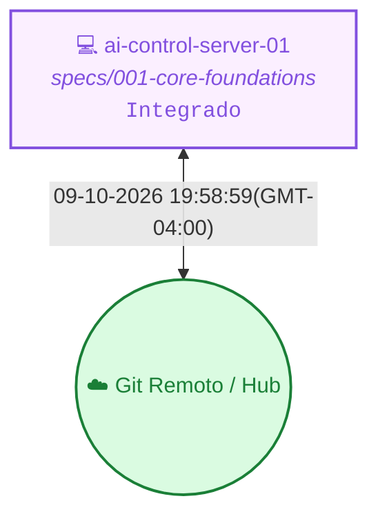

<!-- README.md | Atualizado em: 09-10-2026 20:01:33(GMT-04:00) -->

# 🧠 Painel de Contexto — ai-control

> **Vitalia Kit v0.5.0 — Ledger de Memória Persistente e Orquestração Multi-Máquina.**  
> Este repositório armazena o histórico distribuído, aprendizados consolidados e o controle de concorrência das sessões de trabalho do framework Vitalia.

---

## 📡 Topologia de Shards & Sincronização

---

## 🖥️ Máquinas e Status Atual

<table>
  <thead>
    <tr>
      <th align="left">Máquina / ID</th>
      <th align="left">Tarefa Atual</th>
      <th align="center">Ambiente</th>
      <th align="center">Status</th>
      <th align="left">Último Sync</th>
      <th align="left">Próximo Passo (P0)</th>
    </tr>
  </thead>
  <tbody>
    <tr>
      <td><strong>ai-control-server-01</strong> (<code>c01fdc4a</code>)</td>
      <td>specs/001-core-foundations</td>
      <td align="center"></td>
      <td align="center">● Concluído</td>
      <td>09-10-2026 19:58:59(GMT-04:00)</td>
      <td><strong>Adequação do core/management/commands/seed_demo.py e criação da primeira versão do frontend para consumo da API.</strong></td>
    </tr>
  </tbody>
</table>

---

## 🎯 Sessão Ativa em Destaque

- **Estação Ativa:** `ai-control-server-01` (`c01fdc4a`)
- **Tarefa em Execução:** specs/001-core-foundations
- **🎯 Próximo Passo Prioritário (P0):** `Adequação do core/management/commands/seed_demo.py e criação da primeira versão do frontend para consumo da API.`
- **Última Sincronização:** `09-10-2026 19:58:59(GMT-04:00)`

---

## 📚 Histórico, Decisões & Guard Rails

<strong>🔍 Clique para expandir o Histórico Completo de Sessões</strong>

 

| Data / Hora | Estação (ID) | Tarefa Executada | Próximo Passo (P0) |
| :--- | :--- | :--- | :--- |
| 09-10-2026 19:58:59(GMT-04:00) | `ai-control-server-01 (c01fdc4a)` | specs/001-core-foundations | `Adequação do core/management/commands/seed_demo.py e criação da primeira versão do frontend para consumo da API.` |
| 08-10-2026 09:45:32(GMT-04:00) | `ai-control-server-01 (c01fdc4a)` | Treinamento Socrático e Sumário Executivo | `Nenhum pendente. A base documental e arquitetural (backend) está concluída e formalmente empacotada. O próximo passo dependerá da definição de um novo Épico ou repasse para a equipe/stakeholders.` |
| 07-10-2026 17:42:23(GMT-04:00) | `ai-control-server-01 (c01fdc4a)` | Refatoração RBAC 4-Tier e Unificação de Banco | `Nenhum pendente. Backend arquiteturalmente estabilizado.` |
| 07-10-2026 17:42:04(GMT-04:00) | `ai-control-server-01 (c01fdc4a)` | Refatoração RBAC 4-Tier e Unificação de Banco | `Nenhum pendente. Backend arquiteturalmente estabilizado.` |

<strong>⚖️ Clique para expandir as Decisões Arquiteturais Consolidadas</strong>

 

| Máquina (ID) | Decisão Arquitetural | Impacto / Racional |
| :--- | :--- | :--- |
| `c01fdc4a` | **[988450cd]** `[ARQUITETURA]` Uso de blocos 'collapsible' (
) do Markdown Socrático. | Emula a dinâmica socrática, forçando o desenvolvedor (usuário final) a raciocinar sobre os Post-Mortems de arquitetura antes de visualizar a solução da equipe. |
| `c01fdc4a` | **[3e834ed9]** `[ARQUITETURA]` Armazenamento dos Manuais de Negócios e Treinamento estritamente no repositório Git (Não exposto publicamente). | Evita a exposição acidental em portais estáticos inseguros (MkDocs) de documentos que contêm estratégias de engenharia e regras sensíveis de RBAC do sistema. |
| `c01fdc4a` | **[af47736b]** `[ARCH]` Implementação do RBAC Hierárquico 4-Tier atrelado aos Documentos de RAG, usando slugs de permissão em vez de roles textuais fixas no Middleware. | Registro defasado |

<strong>🛡️ Clique para expandir os Guard Rails de Grounding e Domínios</strong>

 

| Arquivo de Regras | Status | Domínios Monitorados | Pendentes de Curadoria HITL |
| :--- | :---: | :--- | :---: |
| `grounding-domains.yaml` (Global) | ✅ Ativo | `llm_models`, `python_packages`, `external_apis`, `security_practices`, `regulations`, `cloud_services`, `scientific_claims` | — |
| `grounding-domains-local.yaml` (Projeto) | ✅ Sincronizado | Domínios locais específicos do workspace | `0 pendências` |

---

Painel gerado automaticamente pelo motor de contexto do Vitalia Kit (<code>vitalia_context_engine.py --action consolidate</code>).
